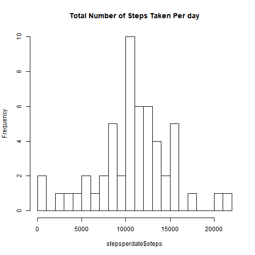
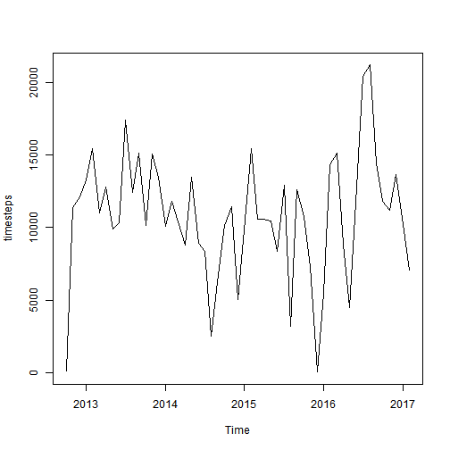
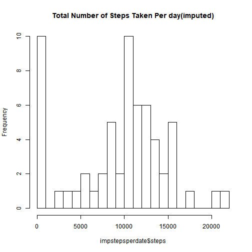
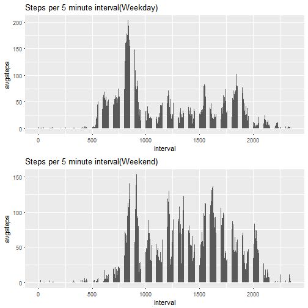

##Code for reading in the dataset and/or processing the data

```r
data <- read.csv("activity.csv")
```
##Histogram of the total number of steps taken each day

```r
stepsperdate <- aggregate(steps~date, data, sum, na.rm=TRUE)
head(stepsperdate)
```

```
##         date steps
## 1 2012-10-02   126
## 2 2012-10-03 11352
## 3 2012-10-04 12116
## 4 2012-10-05 13294
## 5 2012-10-06 15420
## 6 2012-10-07 11015
```

```r
hist(stepsperdate$steps, breaks=17, main="Total Number of Steps Taken Per day")  
```



##Mean and median number of steps taken each day

```r
median(stepsperdate$steps)
```

```
## [1] 10765
```

```r
mean(stepsperdate$steps)
```

```
## [1] 10766.19
```
##Time series plot of the average number of steps taken

```r
timesteps <- ts(stepsperdate$steps, start=c(2012,10,1), frequency=12)
plot(timesteps)
```



##The 5-minute interval that, on average, contains the maximum number of steps

```r
library(plyr)
stepsperint <- ddply(data, .(interval), summarise, avgsteps=mean(steps, na.rm=T))
stepsperint[stepsperint$avgsteps==max(stepsperint$avgsteps), ]
```

```
##     interval avgsteps
## 104      835 206.1698
```
##Code to describe and show a strategy for imputing missing data

```r
library(DMwR)
impdata <- centralImputation(data)
```
##Histogram of the total number of steps taken each day after missing values are imputed

```r
impstepsperdate <- aggregate(steps~date, impdata, sum, na.rm=TRUE)
head(impstepsperdate)
```

```
##         date steps
## 1 2012-10-01     0
## 2 2012-10-02   126
## 3 2012-10-03 11352
## 4 2012-10-04 12116
## 5 2012-10-05 13294
## 6 2012-10-06 15420
```

```r
hist(impstepsperdate$steps, breaks=17, main="Total Number of Steps Taken Per day(imputed)")
```



        ##Panel plot comparing the average number of steps taken per 5-minute interval across weekdays and weekends

```r
impdata2 <- impdata
impdata2$date <- as.Date(impdata$date)
Sys.setlocale("LC_TIME", "us")
```

```
## [1] "English_United States.1252"
```

```r
endimpdata <- impdata2[weekdays(impdata2$date)=="Saturday"|weekdays(impdata2$date)=="Sunday",]
dayimpdata <- impdata[weekdays(impdata2$date)!="Saturday"& weekdays(impdata2$date)!="Sunday",]
endstepsperint <- ddply(endimpdata, .(interval), summarise, avgsteps=mean(steps, na.rm=T))
daystepsperint <- ddply(dayimpdata, .(interval), summarise, avgsteps=mean(steps, na.rm=T))
library(ggplot2)
library(gridExtra)
gendstepsperint <- ggplot(endstepsperint) + geom_col(aes(interval, avgsteps)) + labs(title="Steps per 5 minute interval(Weekend)")
gdaystepsperint <- ggplot(daystepsperint) + geom_col(aes(interval, avgsteps)) + labs(title="Steps per 5 minute interval(Weekday)")
grid.arrange(gdaystepsperint, gendstepsperint)
```



##All of the R code needed to reproduce the results (numbers, plots, etc.) in the report
#### All R codes are included above. 

